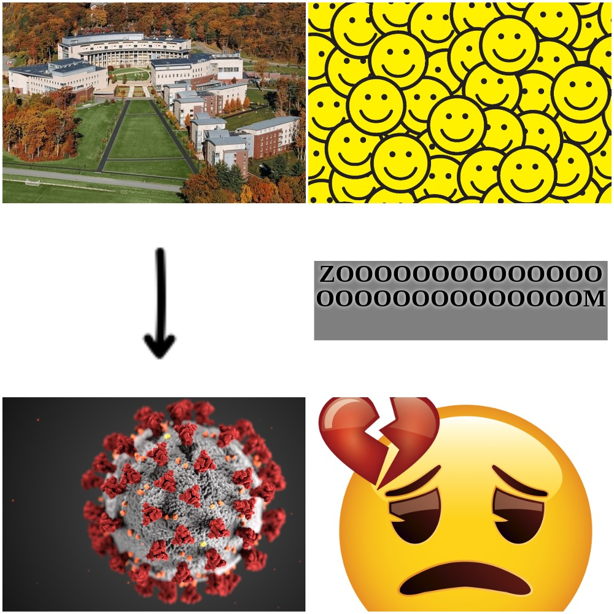
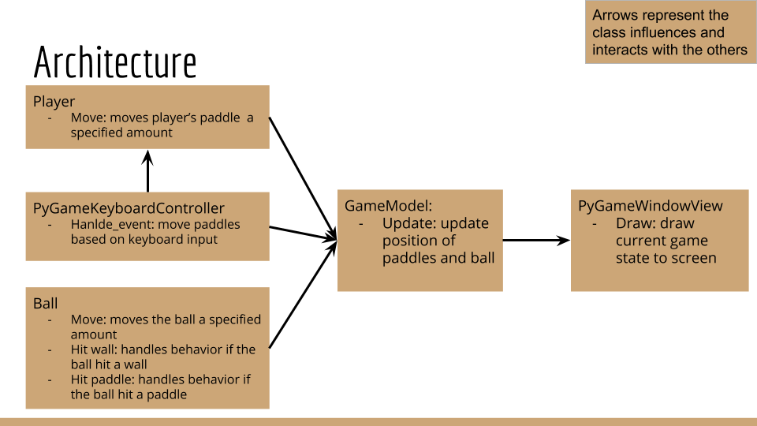
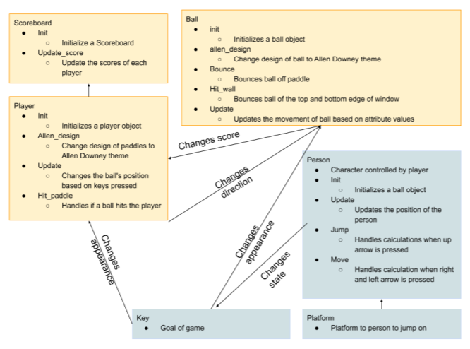

# Our Process and Learning
To say this project experience was an adventure that we didn't expect, would be a gross understatement. In previous semesters of Software Design, this project would have been the final mini-project before the final project. However, the day we got assigned this mini-project, we received news that shattered our world. The entire campus got an email that Olin was going remote for the remainder of the semester due to COVID-19, and we all had to go home. This was unprecedented, and the mini-project morphed into just creating a basic class structure. The rest of that project was done remote, as was the final project. This was all while trying to adjust to the current "normal" situation of the world and being at home 24/7. It was rough. However, it also served as motivation to make people of the Olin community smile. The photo below shows our process and feelings before and after the COVID-19 announcement. On campus == happy, Off campus all at our homes == sad.

While creating our basic class structure, we did not have to include any implementation. Neither of us had any experience with Pygame, so we tried to create a strong class structure that we could expand upon and implement in the final project. But, of course, it was not this linear. Since we didn't have Pygame experience, we did not set up an ideal class structure. The image below is a mini-outline of our original structure.

After beginning the implementation, we did a redesign of our plans and started from scratch. It would have been easier if we were still on campus together, as remote brainstorming (although there are useful tools) is still inferior to sitting next to each other. After we set up a new structure, with [Real Python Pygame Tutorial](https://realpython.com/pygame-a-primer/) as a reference, we mainly worked asynchronously. The image below shows our updated class structure for the main pong game along with the adventure mini-game.

